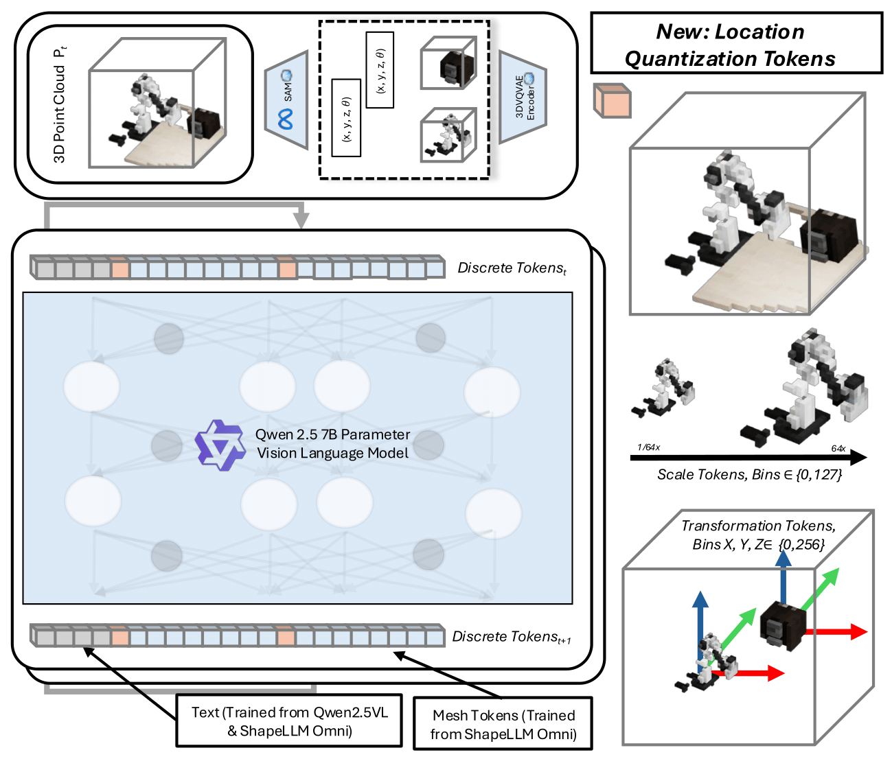
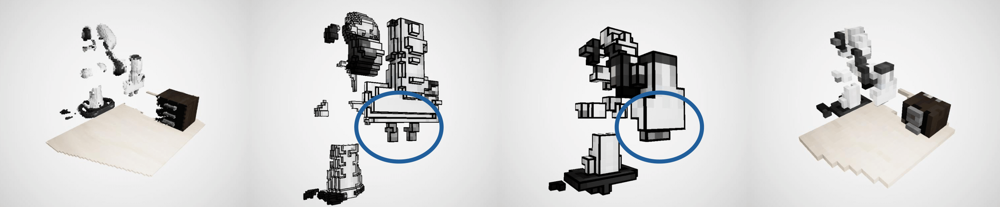

# Avi: Action from Volumetric Inference

This is the repository that contains source code for the [Avi website](https://action-volume-inference.github.io).

If you find Avi useful for your work please cite:
```
@article{avi2024,
  title={Avi: Action from Volumetric Inference},
  author={Research Team},
  journal={arXiv preprint},
  year={2024}
}
```

## About Avi

Avi (Action from Volumetric Inference) is a novel 3D Vision-Language-Action (VLA) architecture that reframes robotic control as a problem of volumetric reasoning rather than low-level policy generation. By leveraging ShapeLLM-Omni as a 3D Multi-Modal Language Model and extending it with location quantization, we enable the model to interpret natural language instructions and predict goal-conditioned 3D representations of the environment.


## Key Features

- **3D Volumetric Reasoning**: Predicts transformed 3D point clouds instead of action tokens
- **Location Quantization**: Discretizes spatial information for better generalization
- **Morphology-Agnostic**: Works across different robot embodiments via inverse kinematics
- **Natural Language Control**: Accepts human-readable instructions for robotic tasks

## Comparison with Related Work


## Technical Architecture

<div style="display: flex; align-items: flex-start; gap: 20px;">
<div style="flex: 1;">

- **3D VQVAE Encoder/Decoder**: Maps voxelized 3D shapes into discrete latent representations
- **Qwen 2.5 7B**: Vision-Language Model backbone for language understanding
- **SAM (Segment Anything Model)**: For object segmentation and isolation
- **LoRA Injection**: Efficient parameter updates without full model retraining
- **ICP (Iterative Closest Point)**: Geometric optimization for spatial alignment

</div>
<div style="flex: 1;">



</div>
</div>

## Future Work



## Website License
<a rel="license" href="http://creativecommons.org/licenses/by-sa/4.0/"></a><br />This work is licensed under a <a rel="license" href="http://creativecommons.org/licenses/by-sa/4.0/">Creative Commons Attribution-ShareAlike 4.0 International License</a>.
